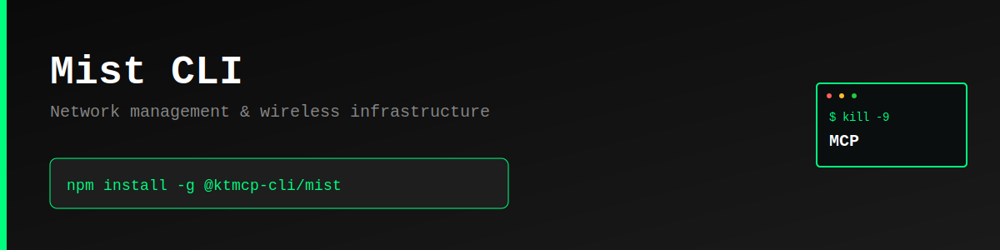

> "Six months ago, everyone was talking about MCPs. And I was like, screw MCPs. Every MCP would be better as a CLI."
>
> — [Peter Steinberger](https://twitter.com/steipete), Founder of OpenClaw
> [Watch on YouTube (~2:39:00)](https://www.youtube.com/@lexfridman) | [Lex Fridman Podcast #491](https://lexfridman.com/peter-steinberger/)

# Mist CLI

Command-line interface for Mist API - Manage network infrastructure, wireless access points, and network analytics.

> **⚠️ Unofficial CLI** - This tool is not officially sponsored, created, or supported by Mist. It's a community-built CLI for the Mist API.

## Features

- 🚨 **Alarm Definitions** - Get alarm definitions and configurations
- 📡 **AP Channels** - View access point channel configurations
- 📱 **Applications** - List application definitions
- 🌍 **Country Codes** - Get regulatory country codes
- 🔧 **Device Models** - View supported device models
- 📊 **Metrics** - Access insight metrics for analytics

## Why CLI > MCP

CLIs are:
- **Faster** - No server overhead, direct execution
- **Simpler** - Standard UNIX tools, easy to integrate
- **Composable** - Pipe data, chain commands, automate workflows
- **Debuggable** - Clear inputs and outputs
- **Universal** - Works everywhere Node.js runs

## Installation

```bash
npm install -g @ktmcp-cli/mist
```

## Quick Start

```bash
# Configure API settings
mist configure --url https://api.mist.com/api/v1 --token YOUR_API_TOKEN

# Get alarm definitions
mist alarms

# Get AP channel definitions
mist channels

# Get applications
mist applications

# Get country codes
mist countries

# Get device models
mist device-models

# Get insight metrics
mist metrics

# Get JSON output
mist applications --json
```

## Commands

### `configure`

Configure API settings:

```bash
mist configure --url <api-url> --token <api-token>
```

### `alarms`

Get alarm definitions:

```bash
mist alarms
mist alarms --json
```

### `channels`

Get AP channel definitions:

```bash
mist channels
mist channels --json
```

### `applications`

Get application definitions:

```bash
mist applications
mist applications --json
```

### `countries`

Get country codes:

```bash
mist countries
mist countries --json
```

### `device-models`

Get device model definitions:

```bash
mist device-models
mist device-models --json
```

### `metrics`

Get available insight metrics:

```bash
mist metrics
mist metrics --json
```

## API Documentation

- [Mist API Documentation](https://doc.mist-lab.fr/)
- [Postman Documentation](https://documenter.getpostman.com/view/224925/SzYgQufe)

## License

MIT © KTMCP

---

**Part of the [Kill The MCP](https://killthemcp.com/mist-cli) project** - Simple CLIs over complex protocols.
